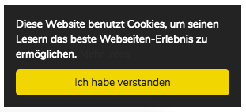

# Cookie Approval Plugin

A plugin for [Kirby 3 CMS](http://getkirby.com) that shows an cookie approval banner to use in your templates.



## Commercial Usage

This plugin is free but if you use it in a commercial project please consider

- [making a donation](https://www.paypal.me/schnti/5) or
- [buying a Kirby license using this affiliate link](https://a.paddle.com/v2/click/1129/48194?link=1170)

## Installation

### Download

[Download the files](https://github.com/schnti/kirby3-cookie/archive/master.zip) and place them inside `site/plugins/cookie`.

### Composer

```
composer require schnti/cookie
```

### Git Submodule
You can add the plugin as a Git submodule.

    $ cd your/project/root
    $ git submodule add https://github.com/schnti/kirby3-cookie.git site/plugins/cookie
    $ git submodule update --init --recursive
    $ git commit -am "Add Kirby Cookie plugin"

Run these commands to update the plugin:

    $ cd your/project/root
    $ git submodule foreach git checkout master
    $ git submodule foreach git pull
    $ git commit -am "Update submodules"
    $ git submodule update --init --recursive


### CSS (SCSS)
```SCSS
$ka-cookie-bg: #222 !default;
$ka-cookie-color: #fff !default;
$ka-cookie-link-color: #31a8f0 !default;
$ka-cookie-link-color-hover: #b2f7ff !default;
$ka-cookie-btn-bg: #f1d600 !default;
$ka-cookie-btn-color: #222 !default;
$ka-cookie-position: bottom-right !default; // top-left, top-right, bottom-left, bottom-right
```

```SCSS
@import "../website/site/plugins/cookie/cookie.scss";
```

## Options

### Config options

You can set the following default options in your `config.php`:

```
'schnti.cookie.link'    => 'datenschutzerklaerung'
```

## How to use it

use this right before closing `</body>` tag

```php
<?= snippet('cookie'); ?>
```